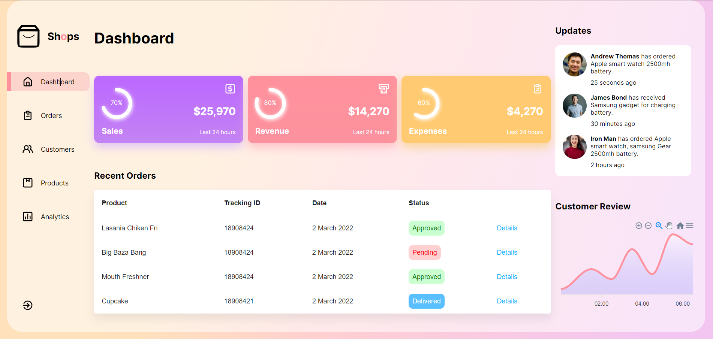

# React Admin Panel Design


<h2> Introducción</h2>
Aplicación de react responsiva diseñada como panel de administracion con una interfaz amigable que permite observar y administrar una page.

</br>

- [React Admin Panel Design](#react-admin-panel-design)
- [Instalación](#instalación)
  - [Dependencias:](#dependencias)
  - [Interfaz:](#interfaz)
- [Documentacion importante:](#documentacion-importante)


# Instalación


## Dependencias:
Asumiendo que tiene node.js preinstalado, asegurese de que su terminal este posicionada en la carpeta raiz del proyecto y ejecute  el siguiente comando para instalar todas las dependencias necesarias:
```
npm install
```

Ahora ya puedes comenzar a ejecutar el programa con el siguiente comando:
```
npm start
```
Esto abrira el puerto 3000, permitiendo ver todo de manera local.


<br>

## Interfaz: 
Una vez iniciado el proyecto podras visualizar la interfaz de esta forma:



<br>

# Documentacion importante:
- https://create-react-app.dev/docs/getting-started (generador)
- https://apexcharts.com/docs/installation/ (graficos)
- https://vercel.com/docs (infraestructura para desplegar)

